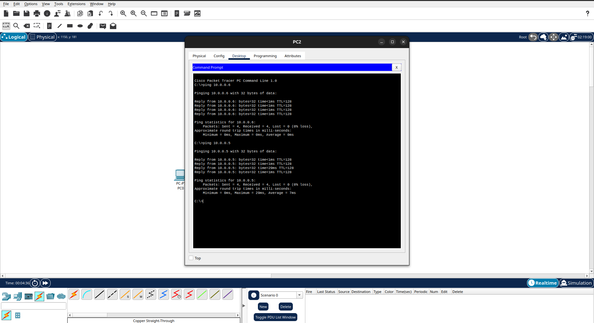
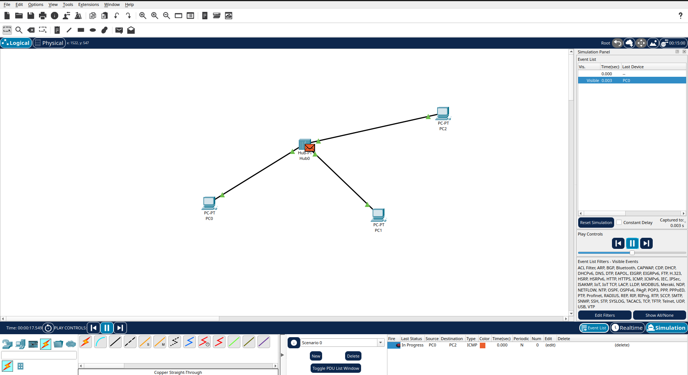
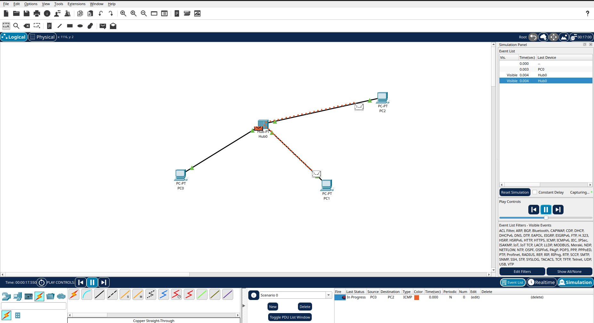
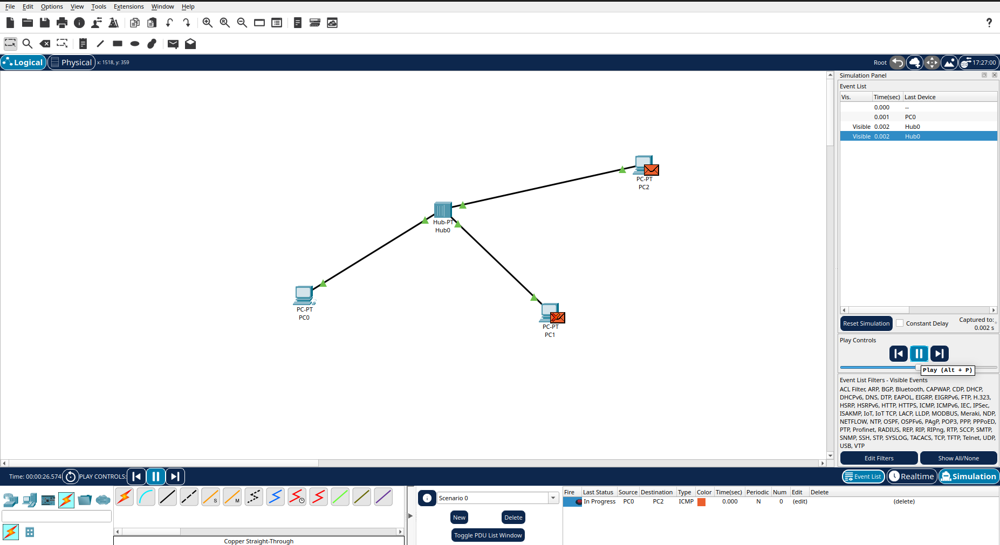
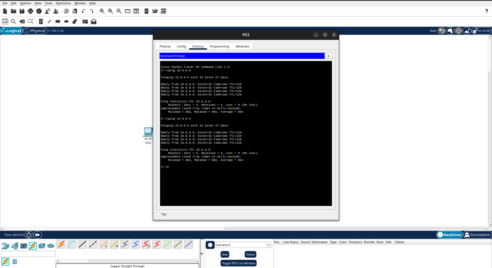
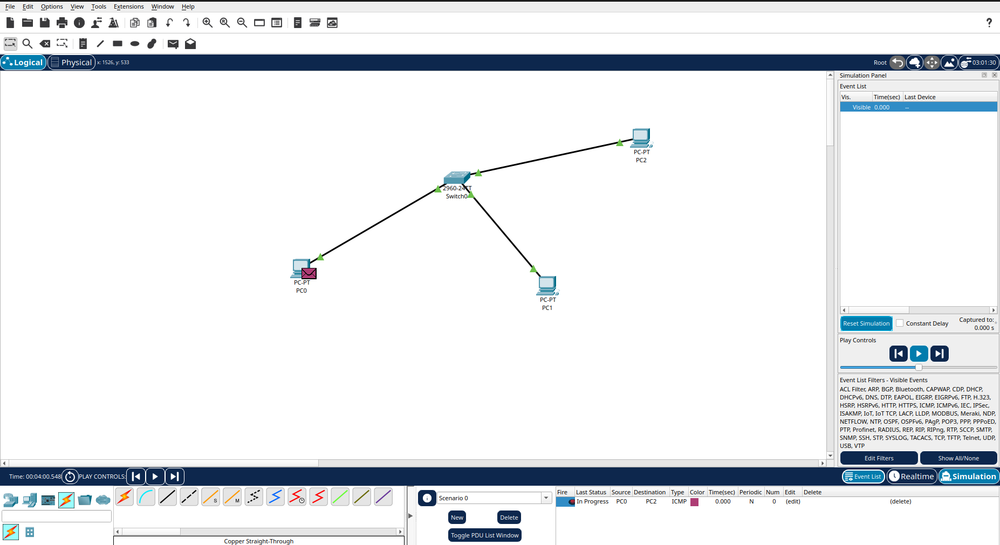
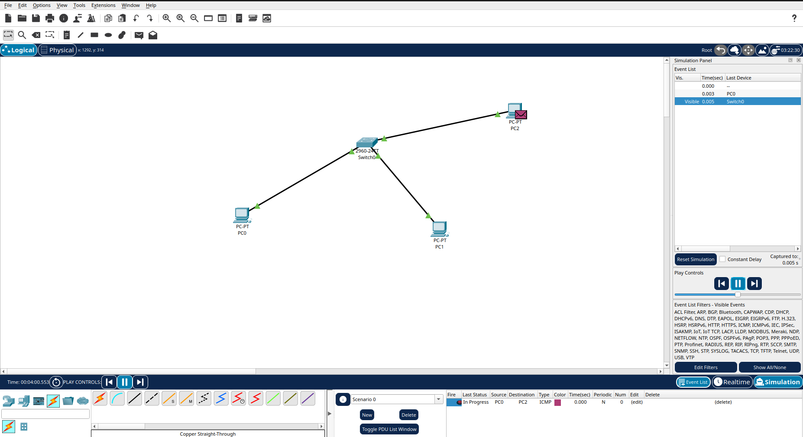

# Relatório Técnico — Análise de Camada Física: Hub vs. Switch

---

## Cenário 1 — Rede com Hub e Análise de Propagação de Sinal

### Descrição da Topologia

O primeiro cenário consiste em três Personal Computers (PC0, PC1 e PC2) conectados a um Hub central via cabo par trançado (Straight-Through). Os endereços IP foram configurados manualmente conforme a tabela abaixo:

| Dispositivo | Endereço IP | Máscara de Sub-rede |
|:-----------:|:-----------:|:-------------------:|
| PC0         | 10.0.0.5    | 255.0.0.0           |
| PC1         | 10.0.0.6    | 255.0.0.0           |
| PC2         | 10.0.0.7    | 255.0.0.0           |

O Hub é um dispositivo de Camada 1 (Física) do modelo OSI. Ele não possui inteligência de endereçamento — seu único papel é receber um sinal elétrico em uma porta e replicá-lo imediatamente para todas as demais portas, sem qualquer análise do conteúdo do quadro.

### Teste de Conectividade (Ping)

Com a topologia montada e os IPs configurados, foi realizado o teste de conectividade com o comando `ping` entre todos os pares de dispositivos. O resultado confirma que todos os nós se comunicam corretamente dentro da rede.

*Figura 1 — Teste de conectividade (ping) entre PC0, PC1 e PC2 via Hub.*

---

### Simulação de PDU — PC0 → PC2

Uma Simple PDU foi enviada do PC0 para o PC2 utilizando o modo de simulação do Packet Tracer. As capturas abaixo documentam o passo a passo da propagação:

*Figura 2 — PDU enviada pelo PC0 chega à porta de entrada do Hub.*

*Figura 3 — O Hub replica o sinal elétrico para todas as portas (PC1 e PC2 recebem o quadro simultaneamente).*

*Figura 4 — PC2 aceita o quadro (destinatário correto); PC1 analisa e descarta o quadro (endereço MAC não coincide).*

---

### Respostas às Questões Técnicas

#### a) Por que todos os nós recebem o quadro inicialmente dentro de um Hub?

O Hub opera exclusivamente na Camada Física (Camada 1) do modelo OSI. Ele não é capaz de interpretar endereços MAC, endereços IP ou qualquer outro identificador lógico presente nas camadas superiores. Ao receber um sinal elétrico em uma de suas portas, o Hub simplesmente amplifica e retransmite esse sinal para todas as outras portas ativas, de forma indiscriminada.

Isso significa que, na perspectiva do Hub, não existe "destinatário", existe apenas um sinal elétrico que precisa ser propagado pelo meio físico. Quem decide aceitar ou descartar o quadro é o próprio dispositivo final, que compara o endereço MAC de destino do quadro com o seu próprio endereço.

#### b) Como isso se relaciona ao conceito de meio compartilhado e ao desempenho real na camada física?

Em uma rede baseada em Hub, todos os dispositivos compartilham o mesmo domínio de colisão. Isso é o que caracteriza o meio compartilhado: o canal físico (os cabos de par trançado e o barramento interno do Hub) é utilizado por todos os nós ao mesmo tempo.

Na prática, isso impõe restrições severas de desempenho:

- **Colisões:** Se dois dispositivos transmitirem simultaneamente, os sinais elétricos se sobrepõem no meio físico, corrompendo ambos os quadros. O protocolo CSMA/CD (Carrier Sense Multiple Access with Collision Detection) é utilizado para gerenciar esse problema, os nós detectam a colisão, param a transmissão, aguardam um tempo aleatório (backoff) e tentam novamente.
- **Half-duplex obrigatório:** Como o meio é compartilhado, nenhum dispositivo pode transmitir e receber ao mesmo tempo. A comunicação é sempre half-duplex, reduzindo à metade a largura de banda efetiva disponível.
- **Degradação com escala:** À medida que mais dispositivos são adicionados à rede, o número de colisões aumenta exponencialmente. Em uma rede com 10 hosts em um Hub de 10 Mbps, a banda efetiva disponível para cada host pode cair para menos de 1 Mbps em condições de carga moderada.

---

## Cenário 2 — Rede com Switch e Comparação Física

### Descrição da Topologia

No segundo cenário, o Hub foi substituído por um Switch Cisco Catalyst 2960, mantendo os mesmos três PCs, os mesmos endereços IP e a mesma topologia física de estrela. O Switch é um dispositivo de Camada 2 (Enlace de Dados) do modelo OSI.

| Dispositivo | Endereço IP | Máscara de Sub-rede |
|:-----------:|:-----------:|:-------------------:|
| PC0         | 10.0.0.5    | 255.0.0.0           |
| PC1         | 10.0.0.6    | 255.0.0.0           |
| PC2         | 10.0.0.7    | 255.0.0.0           |

Durante essa fase de estabilização, o Switch também popula sua tabela CAM (Content Addressable Memory), que mapeia endereços MAC às portas físicas. Essa tabela é mantida em memória de alto desempenho, com entradas que expiram após aproximadamente 300 segundos de inatividade.

### Teste de Conectividade (Ping)

*Figura 5 — Teste de conectividade (ping) entre PC0, PC1 e PC2 via Switch 2960. Todos os pings são bem-sucedidos.*

---

### Simulação de PDU — PC0 → PC2

A mesma Simple PDU foi enviada novamente do PC0 para o PC2 com o Switch em operação:

*Figura 6 — PDU enviada pelo PC0.*

*Figura 7 — O Switch consulta sua tabela CAM, identifica a porta associada ao MAC de PC2 e encaminha o quadro exclusivamente para essa porta.*

*Figura 8 — Apenas PC2 recebe a PDU. PC1 não recebe nenhum sinal elétrico nesta transmissão.*

---

### Respostas às Questões Técnicas

#### a) Compare o fluxo do sinal elétrico no Switch versus no Hub

No **Hub**, o sinal elétrico recebido em uma porta é imediatamente regenerado e transmitido para **todas as outras portas** sem exceção. O Hub não armazena o sinal nem toma qualquer decisão — ele é um repetidor multoporta que opera no nível de bits individuais.

No Switch, o processo é fundamentalmente diferente. O sinal elétrico recebido em uma porta é primeiro convertido em dado digital e armazenado em buffer. O Switch então lê o cabeçalho do quadro Ethernet para extrair o endereço MAC de destino, consulta sua tabela CAM e transmite o sinal elétrico apenas pela porta específica onde aquele MAC foi aprendido. Fisicamente, nenhum sinal chega às demais portas, os circuitos elétricos são isolados.

#### b) Por que a PDU não é propagada para todos os nós da mesma forma?

Porque o Switch opera na **Camada 2 (Enlace de Dados)** e utiliza endereçamento MAC para tomar decisões de encaminhamento. Quando um quadro chega a uma porta do Switch, ele executa o seguinte processo:

1. **Aprendizado:** Registra na tabela CAM o endereço MAC de origem do quadro e a porta física pela qual ele chegou.
2. **Consulta:** Procura o endereço MAC de destino na tabela CAM.
3. **Encaminhamento seletivo:** Se o MAC de destino for encontrado, o quadro é enviado somente pela porta correspondente.
4. **Flooding controlado:** Se o MAC de destino ainda não for conhecido (tabela CAM vazia ou entrada expirada), o Switch executa um flooding, envia o quadro para todas as portas, exceto a de origem, comportamento temporariamente similar ao Hub, porém limitado a essa situação específica.

No cenário simulado, após os pings iniciais do teste de conectividade, a tabela CAM já estava populada com os MACs de PC1 e PC2. Por isso, ao enviar a PDU do PC0 para PC2, o Switch encaminhou o quadro diretamente para a porta de PC2, sem envolver PC1.

#### c) O Switch elimina o meio físico compartilhado? Justifique tecnicamente

Parcialmente sim, mas com uma ressalva importante. O Switch fragmenta o domínio de colisão: cada porta do Switch representa um domínio de colisão independente. Isso significa que PC0, PC1 e PC2 possuem cada um seu próprio segmento dedicado entre o dispositivo e o Switch, fisicamente, os cabos de par trançado de cada PC não compartilham o mesmo meio elétrico entre si.

Com isso, o Switch habilita comunicação full-duplex em cada porta: um dispositivo pode transmitir e receber simultaneamente sem risco de colisão, eliminando a necessidade do CSMA/CD naquele segmento.

No entanto, o Switch não elimina completamente o conceito de meio compartilhado nos seguintes cenários:
- **Broadcasts:** Quadros com endereço MAC de destino `FF:FF:FF:FF:FF:FF` ainda são enviados para todas as portas, pois o Switch não pode limitar broadcasts por definição da Camada 2. Todos os dispositivos ainda compartilham o mesmo domínio de broadcast.
- **Flooding temporário:** Enquanto a tabela CAM não está populada, o Switch realiza flooding e o meio se torna temporariamente compartilhado.
- **Uplinks e trunks:** Em redes maiores, portas de uplink entre switches podem se tornar gargalos compartilhados.

Portanto, o Switch elimina o meio compartilhado no nível do domínio de colisão, mas mantém um domínio de broadcast compartilhado entre todos os dispositivos da mesma VLAN ou rede plana.

---

## Comparação entre Cenários

| Característica                    | Hub (Cenário 1)                      | Switch 2960 (Cenário 2)                     |
|:----------------------------------|:-------------------------------------|:--------------------------------------------|
| **Camada OSI**                    | Camada 1 — Física                    | Camada 2 — Enlace de Dados                  |
| **Propagação de sinal**           | Para todas as portas                 | Apenas para a porta do destinatário         |
| **Endereçamento**                 | Nenhum (não analisa quadros)         | Por endereço MAC (tabela CAM)               |
| **Domínio de colisão**            | Único (todos os dispositivos)        | Um por porta (isolados)                     |
| **Domínio de broadcast**          | Único                                | Único (toda a rede/VLAN)                    |
| **Modo de operação**              | Half-duplex obrigatório              | Full-duplex por porta                       |
| **Risco de colisão**              | Alto, aumenta com o número de nós   | Eliminado por porta                         |
| **Desempenho em carga**           | Degrada severamente                  | Mantém performance com múltiplos fluxos     |
| **Protocolo de controle**         | CSMA/CD                              | STP + aprendizado MAC                       |
| **Inteligência**                  | Nenhuma                              | Tabela CAM com persistência de ~300 s       |

---

## Conclusão

Os dois cenários demonstram de forma clara como a escolha do equipamento de interconexão impacta diretamente o comportamento da camada física e de enlace de dados. O Hub, por replicar sinais elétricos indiscriminadamente, cria um ambiente de meio compartilhado sujeito a colisões e degradação de desempenho, adequado apenas para redes legadas ou fins didáticos. O Switch, ao operar com endereçamento MAC e encaminhamento seletivo, isola os domínios de colisão, habilita full-duplex e garante privacidade no tráfego unicast, sendo o padrão adotado em redes Ethernet modernas.

A principal distinção prática observada na simulação foi que o Hub não conhece destinos, ele conhece apenas sinais; enquanto o Switch não apenas conhece destinos, como aprende autonomamente o mapeamento entre endereços e portas físicas, tornando-se um componente ativo e inteligente na camada de enlace.

## Arquivos da Parte 1 e 2
**Parte 1 -** `src/parte1`
**Parte 2 -** `src/parte2`

## Link para o vídeo